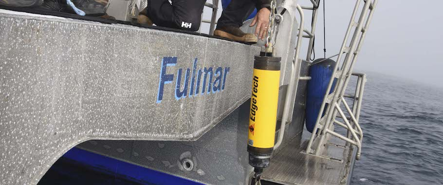
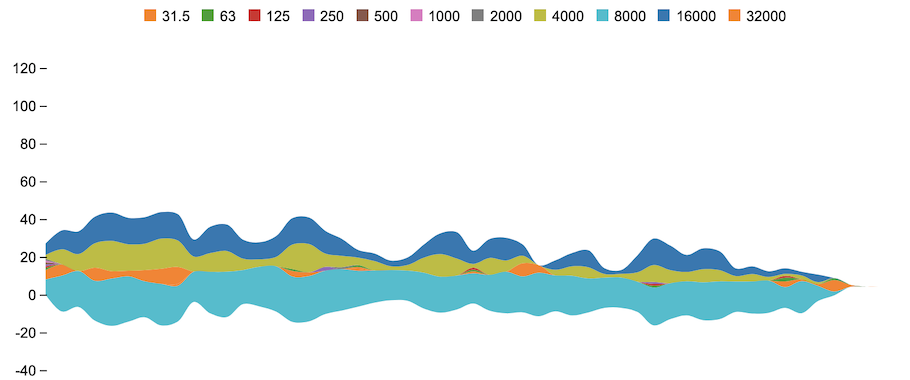
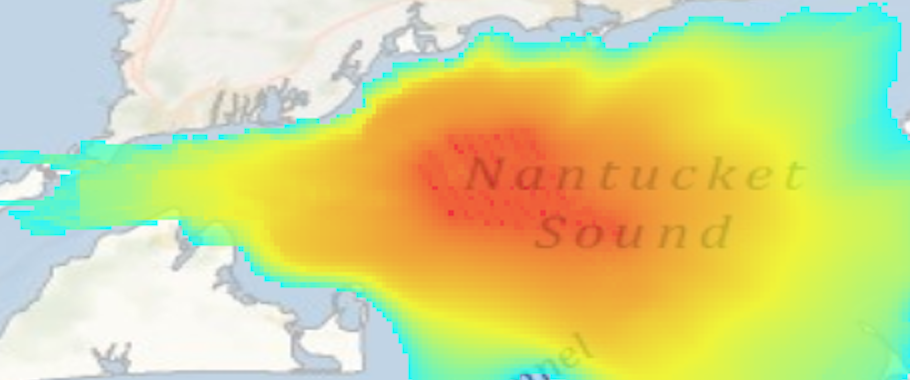

<!-- Indicators -->
<ol class="carousel-indicators">
  <li data-target="#carousel-example-generic" data-slide-to="0" class="active"></li>
  <li data-target="#carousel-example-generic" data-slide-to="1"></li>
  <li data-target="#carousel-example-generic" data-slide-to="2"></li>
</ol>

<!-- Wrapper for slides -->

  

  <a href="q-how-listen.html"> 
  
  

  <h3>How did we listen?</h3>
  
Using acoustic receivers...

  

  </a>
  

  

  <a href="q-what-measure.html.html"> 
  
  

  <h3>What did we measure?</h3>
  
Measuring sound levels at different octaves over time...

  

  </a>
  

  

  <a href="q-what-hear.html"> 
  
  

  <h3>What did we hear?</h3>
  
Natural and man-made noise from various sources...

  

  </a>
  

  
  

  <a href="q-how-far.html"> 
  
  

  <h3>How far could we hear?</h3>
  
Based on sound profile of water...

  

  </a>
  

  

  <a href="q-what-learn.html"> 
  
  

  <h3>What did we learn?</h3>
  
How do we advise human activities...

  

  </a>
  

<!-- Controls -->
<a class="left carousel-control" href="#carousel-example-generic" role="button" data-slide="prev">
  
  Previous
</a>
<a class="right carousel-control" href="#carousel-example-generic" role="button" data-slide="next">
  
  Next
</a>

