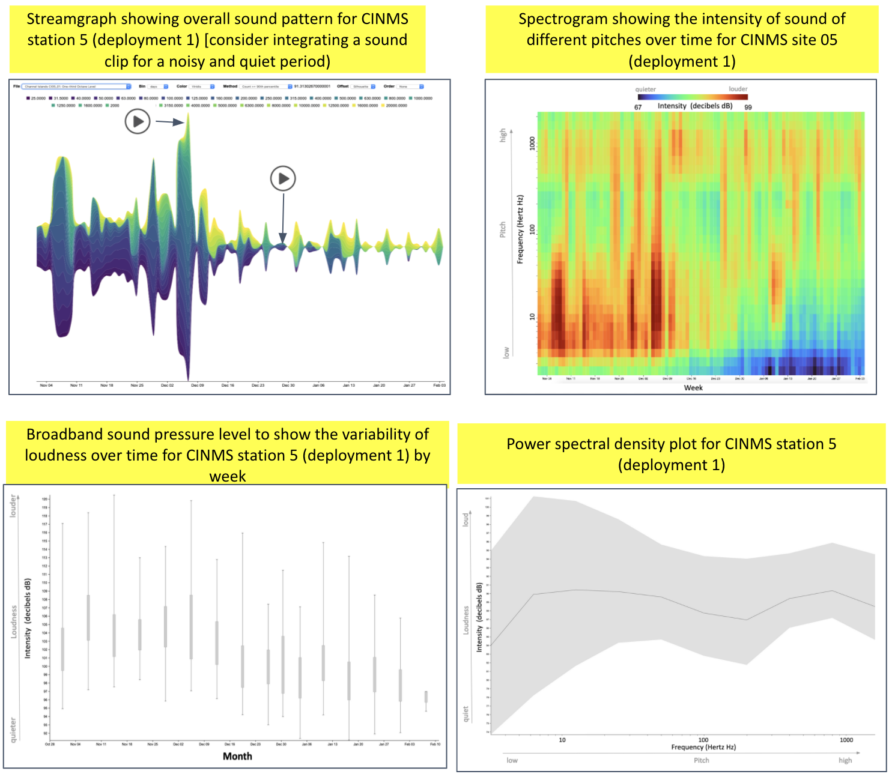

```{r setup, include=FALSE}
knitr::opts_chunk$set(echo = F, message = F, warning = F)
knitr::knit_meta_add(list(rmarkdown::html_dependency_font_awesome()))
```

<script src="https://unpkg.com/masonry-layout@4/dist/masonry.pkgd.min.js"></script>
<script src="https://unpkg.com/imagesloaded@4/imagesloaded.pkgd.min.js"></script>

## {.tabset}

### What did we hear?

<!-- `r shiny::icon("info-circle")` -->
Click the icons in the scene below to listen and learn about the sounds we recorded in this sanctuary.

```{r svg, child = '_svg-html_child.Rmd'}
```

<br>

### Where did we listen?

Here is a map of listening device locations. Hover on a location to see its site id and click on it to see the rationale for its placement.
<!-- `r shiny::icon("map")` -->

```{r}
source(here::here("./functions.R"))
# params = list(site_code = "fknms", main = "Florida Keys National Marine Sanctuary")
# params = list(site_code = "cinms", main = "Channel Islands National Marine Sanctuary")
# params = list(site_code = "hihwnms", main = "Hawaiian Islands Humpback Whale National Marine Sanctuary")
sanctuary_code = toupper(params$site_code)

# soundprop_wms_url <- "https://data.axds.co/gs/sanctsound/wms?styles=&reusetiles=true&unloadInvisibleTiles=true&ENV=min:-72.55591730004457;max:86.51321488678781&STYLES=sanctsound:sanctsound_sound_propagation"
# 
# map_site(params$site_code) %>% 
#   addWMSTiles(
#     soundprop_wms_url,
#     layers = "sanctsound:SanctSound_CI01_prompmodeling_SD0020m_192dBre1uPa_63Hz_January_radarformat_highres_signal_to_noise_ratio",
#     options = WMSTileOptions(
#       format = "image/png", 
#       transparent = T),
#     group = "Sound Propogation",
#     attribution = "Axiom Data Science © 2021") %>% 
#   addLayersControl(
#     # baseGroups = c("Ocean Basemap", "Toner Lite"),
#     overlayGroups = c("Sound Propogation"),
#     options = layersControlOptions(collapsed = F))
map_site(params$site_code)
```


```{r}
# rm(listen)
tbl_listen <- get_sheet("listen") %>% 
  filter(
    sanctuary_code == !!sanctuary_code,
    !is.na(gdrive_shareable_link)) %>% 
  mutate(
    img_rel = map_chr(gdrive_shareable_link, gdrive2path, relative_pfx = "")) %>% 
  filter(
    !is.na(img_rel))
# TODO: resize images to specified width
# imgs %>% 
#   filter(!file_exists(path_w) | redo) %>% 
#   select(path_0, path_w, image_width_inches) %>% 
#   pwalk(~img_convert(..1, ..2, width_in = ..3))  

propagation <- filter(tbl_listen, file_type == "propagation")
duration    <- filter(tbl_listen, file_type == "duration")
```

<!--div class='container'-->
<div class='row'>

<div class='col-md-4'><figure class='figure'>
 
 <figcaption class='figure-caption'>
  `r propagation$caption`
 </figcaption>
</figure></div>

<div class='col-md-8'><figure class='figure'>
 
 <figcaption class='figure-caption'>
  `r duration$caption`
 </figcaption>
</figure></div>

</div><!--/div-->

```{r, results='asis'}
d_s <- get_sheet("sanctuaries") %>% 
  filter(sanctuary_code == !!sanctuary_code)

if (!is.na(d_s$where_question_caption))
  cat(glue("<i class='fas fa-question-circle'></i> <em>{d_s$where_question_caption}</em>\n<br>\n"))

if (!is.na(d_s$where_chart_caption))
  cat(glue("<i class='fas fa-chart-bar'></i> <em>{d_s$where_chart_caption}</em>\n<br>\n"))
```

### What did we measure?

```{r}
tbl_measures <- get_sheet("measures") %>% 
  filter(
    sanctuary_code == !!sanctuary_code,
    !is.na(gdrive_shareable_link)) %>% 
  mutate(
    img_rel = map_chr(gdrive_shareable_link, gdrive2path, relative_pfx = "")) %>% 
  filter(
    !is.na(img_rel))
# TODO: resize images to specified width
# imgs %>% 
#   filter(!file_exists(path_w) | redo) %>% 
#   select(path_0, path_w, image_width_inches) %>% 
#   pwalk(~img_convert(..1, ..2, width_in = ..3))  

above_median  <- filter(tbl_measures, file_type == "above_median")
spectrogram <- filter(tbl_measures, file_type == "spectrogram")
anomaly     <- filter(tbl_measures, file_type == "anomaly")
power_spec  <- filter(tbl_measures, file_type == "power_spec")
```

```{r, results='asis', eval=length(spectrogram$img_rel) == 1}
with(
  spectrogram,
  figure(
    header  = "**Spectrogram**: _intensity of sound at different pitches over time_",
    img     = img_rel,
    caption = caption, 
    size    = "col-md-12"))
```

```{r, results='asis', eval=length(above_median$img_rel) == 1 && length(power_spec$img_rel) == 1}
figure(
  header  = c(
    "**Sound levels above median**: _loudness and contribution of different pitches_",
    "**Power spectrum**: _variability of loudness across pitch_"),
  img     = c(above_median$img_rel, power_spec$img_rel),
  caption = c(above_median$caption, power_spec$caption))
```

```{r, results='asis', eval=length(anomaly$img_rel) == 1}
with(
  anomaly,
  figure(
    header  = "**Anomaly plot**: _deviation of loudness from average_",
    img     = img_rel,
    caption = caption, 
    size    = "col-md-12"))
```

`r shiny::icon("question-circle")` _Learn more about **[what we measured and how to read and understand these summary graphs](./q_what-measure.html)**._
 
`r shiny::icon("chart-bar")` _See similar **[summary graphs](https://sanctsound.portal.axds.co/#)** for the other stations in this sanctuary and here for data available in other sanctuaries._

<!--  -->

### What did we learn?

```{r, results='asis'}

tbl_stories <- import_stories()

snc_stories <- tbl_stories %>% 
    filter(sanctuary == !!sanctuary_code)
  
if (nrow(snc_stories) > 0){

  cat(glue("\n\n<div class='card-columns'>\n\n", .trim = F))
  
  snc_stories %>% 
    pmap_chr(story_card) %>% 
    paste(collapse = "\n\n") %>% 
    cat()
  
  cat("\n\n</div>\n\n")

}
```

`r shiny::icon("question-circle")` _Learn about our **[collection of stories](./q_what-learn.html)**._

`r shiny::icon("newspaper-o")` _Read more **[SanctSound stories](./stories.html)**._


