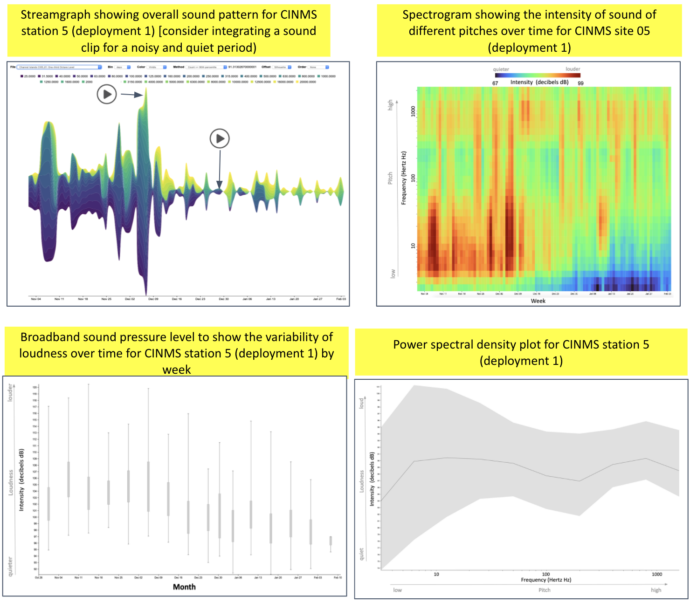

```{r setup, include=FALSE}
knitr::opts_chunk$set(echo = F, message = F, warning = F)
```

<script src="https://unpkg.com/masonry-layout@4/dist/masonry.pkgd.min.js"></script>
<script src="https://unpkg.com/imagesloaded@4/imagesloaded.pkgd.min.js"></script>

## {.tabset}

### **What** did we hear?

<!-- `r shiny::icon("info-circle")` -->
Click on an element to see & hear more.

```{r svg, child = '_svg-html_child.Rmd'}
```

### **Where** did we listen?

Here is a map of listening device locations. Hover on a location to see its site id and click on it to see the rationale for its placement.
<!-- `r shiny::icon("map")` -->

```{r}
source(here::here("draft/functions.R"))
# params = list(site_code = "fknms", main = "Florida Keys National Marine Sanctuary")
# params = list(site_code = "cinms", main = "Channel Islands National Marine Sanctuary")
sanctuary_code = toupper(params$site_code)

map_site(params$site_code)

# soundprop_wms_url <- "https://data.axds.co/gs/sanctsound/wms?styles=&reusetiles=true&unloadInvisibleTiles=true&ENV=min:-72.55591730004457;max:86.51321488678781&STYLES=sanctsound:sanctsound_sound_propagation"
# 
# map_site(params$site_code) %>% 
#   addWMSTiles(
#     soundprop_wms_url,
#     layers = "sanctsound:SanctSound_CI01_prompmodeling_SD0020m_192dBre1uPa_63Hz_January_radarformat_highres_signal_to_noise_ratio",
#     options = WMSTileOptions(
#       format = "image/png", 
#       transparent = T),
#     group = "Sound Propogation",
#     attribution = "Axiom Data Science © 2021") %>% 
#   addLayersControl(
#     # baseGroups = c("Ocean Basemap", "Toner Lite"),
#     overlayGroups = c("Sound Propogation"),
#     options = layersControlOptions(collapsed = F))
```


```{r}
# rm(listen)
tbl_listen <- get_sheet("listen") %>% 
  filter(
    sanctuary_code == !!sanctuary_code,
    !is.na(gdrive_shareable_link)) %>% 
  mutate(
    img_rel = map_chr(gdrive_shareable_link, gdrive2path, relative_pfx = "")) %>% 
  filter(
    !is.na(img_rel))
# TODO: resize images to specified width
# imgs %>% 
#   filter(!file_exists(path_w) | redo) %>% 
#   select(path_0, path_w, image_width_inches) %>% 
#   pwalk(~img_convert(..1, ..2, width_in = ..3))  

propagation <- filter(tbl_listen, file_type == "propagation")
duration    <- filter(tbl_listen, file_type == "duration")
```

<div class='row'>
<div class='col-xs-4'>
  `r with(propagation, if (length(img_rel) == 1) glue(""))`
</div>
<div class='col-xs-8'>
  `r with(duration, if (length(img_rel) == 1) glue(""))`
</div>
</div>

`r shiny::icon("question-circle")` _[Click here](https://en.wikipedia.org/wiki/To_be_announced) to learn more about how we listened to and recorded soundscapes._
 
`r shiny::icon("chart-bar")` _[Click here](https://en.wikipedia.org/wiki/To_be_announced) to see similar maps of the listening range for the other hydrophones in this sanctuary and in other sanctuaries._

### **What** did we measure?

```{r}
tbl_measure <- get_sheet("measure") %>% 
  filter(
    sanctuary_code == !!sanctuary_code,
    !is.na(gdrive_shareable_link)) %>% 
  mutate(
    img_rel = map_chr(gdrive_shareable_link, gdrive2path, relative_pfx = "")) %>% 
  filter(
    !is.na(img_rel))
# TODO: resize images to specified width
# imgs %>% 
#   filter(!file_exists(path_w) | redo) %>% 
#   select(path_0, path_w, image_width_inches) %>% 
#   pwalk(~img_convert(..1, ..2, width_in = ..3))  

streamplot  <- filter(tbl_measure, file_type == "streamplot")
spectrogram <- filter(tbl_measure, file_type == "spectrogram")
anomaly     <- filter(tbl_measure, file_type == "anomaly")
power_spec  <- filter(tbl_measure, file_type == "power_spec")
```

<div class='row'>
<div class='col-xs-12 well'>
  **Spectrogram**: _intensity of different pitches over time_
  
  `r with(spectrogram, if (length(img_rel) == 1) glue(""))`
</div>
</div>
<div class='row'>
<div class='col-xs-6 well'>
  **Streamplot**: _loudness and contribution of different pitches_
  
  `r with(streamplot, if (length(img_rel) == 1) glue(""))`
</div>
<div class='col-xs-6 well'>
  **Power spec**: _variability of loudness across pitch_
  
  `r with(power_spec, if (length(img_rel) == 1) glue(""))`
</div>
</div>
<div class='row'>
<div class='col-xs-12 well'>
  **Anomaly plot**: _deviation of loudness from average_
  
  `r with(anomaly, if (length(img_rel) == 1) glue(""))`
</div>
</div>

`r shiny::icon("question-circle")` _[Click here](https://en.wikipedia.org/wiki/To_be_announced) to learn more about what we measured and how to read and understand these summary graphs._
 
`r shiny::icon("chart-bar")` _[Click here](https://en.wikipedia.org/wiki/To_be_announced) to see similar summary graphs for the other stations in this sanctuary and here for data available in other sanctuaries._

<!--  -->

### **What** did we learn?

```{r, results='asis'}

tbl_stories <- import_stories()

snc_stories <- tbl_stories %>% 
    filter(sanctuary == !!sanctuary_code)
  
if (nrow(snc_stories) > 0){

  cat(glue("\n\n<div class='card-columns'>\n\n", .trim = F))
  
  snc_stories %>% 
    pmap_chr(story_card) %>% 
    paste(collapse = "\n\n") %>% 
    cat()
  
  cat("\n\n</div>\n\n")

}
```


