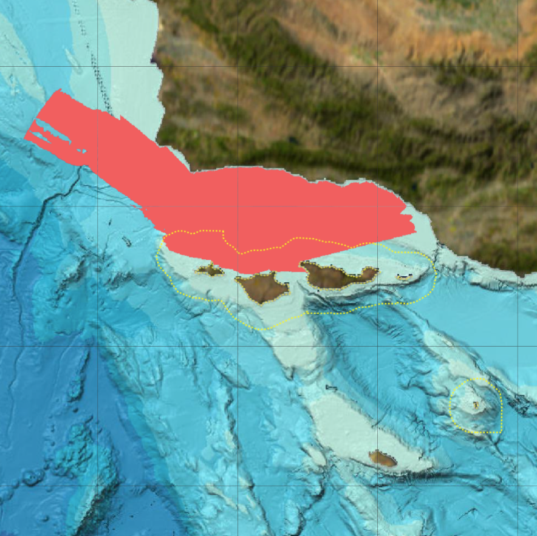

```{r setup, include=FALSE}
knitr::opts_chunk$set(echo = F, message = F, warning = F)
source(here::here("draft/functions.R"))
```

_With your eyes closed, clap your hands. You can tell if you are in a small room or a big auditorium by the way the clap sounds. Many people who are visually impaired have learned to use details in what they hear to tell them about their surroundings, because the paths that sounds take from sources (like your hands) to receivers (like your ears) reflect the environments that that they pass through and bounce off of. The environment affects what we hear underwater as well, and we have to account for its influence on our recordings when we make comparisons over seasons and among very different locations._

The goal of the SanctSound project was to understand how sound varies in the ocean by collecting the same information in sanctuaries around the United States. To do this, 30 locations within seven national marine sanctuaries and one marine national monument were selected to listen to the ocean, as continuously as possible, over a period of three years.

<!--  -->

```{r}
map_sites()
```

::: { .overflow-auto}

```{r, results='asis'}
figure(
  img = "./images/questions/Animation.gif",
  caption = "This animation shows sound waves propagating away from two sources of sound, a blue whale and a dolphin. The blue whale’s lower frequency calls are heard over larger distances, and are recorded on three of the four yellow circle recording stations. The dolphin’s calls are higher frequency and are heard over a shorter distance and recorded only on only one nearby yellow circle recording station.",
  alt = "graphic of wide sound rings emanating out of blue whale and narrower ones from dolphins.",
  align = "right")
```

Each of the 30 locations recorded sounds over different ranges. When you listen in a specific place, your ability to hear different sounds is dependent on the sound itself and the path the sound travels from the source to you – or in this case, the hydrophone. Important qualities for the sound include how loud it is and the frequencies, or tones, it contains. Louder and lower pitch sounds can generally be heard farther away than quieter and higher pitch sounds. But the path that sound wave takes through the water, known as a sound’s “propagation,” is influenced by numerous factors like the depth of the source in the water column, the depth of the seafloor, whether the seafloor is hard or soft, bumpy or flat, and properties of the water itself such as salinity, temperature, and density.

:::

::: { .overflow-auto}

```{r, results='asis'}
figure(
  img     = "./images/questions/Propogation_CI01_CI05_50Hz.png",
  caption = "Comparison of listening ranges for two different recording locations in the Channel Islands National Marine Sanctuary in summer conditions and for the same louder, low frequency source.",
  alt     = "",
  align   = "left")
```

When we compare and explore recordings, it’s important to know whether they represent sounds heard over very short distances or longer distances from where we placed our recorders. To estimate the “listening ranges” of our recorders, we applied mathematical models of sound wave propagation combined with the known characteristics of the environment around each location (e.g., depth, composition of seabed), the known or assumed characteristics of several different sounds of interest (the intensity and main frequency content of boats, fish calls, and whale song), and estimated wind-induced noise, which can mask the signal in our recordings. 

Under the “Where did we listen” tab for each sanctuary on the website, there is an example map showing the estimated listening range for one of the sanctuary’s listening stations. Use the ‘Statistics’ pull down in the Navigation Bar to access the SanctSound data portal’s sound propagation maps and models for more detailed exploration of listening ranges at a recording location, including how they change according to the frequencies and seasons of interest. You can also look at the variation across recording locations.

For example, these results predict that during the summer a sound with characteristics like those made by a large vessel (192 decibels at a frequency at 63 Hertz, located 20 meters below the ocean surface) can be heard north of our recorder off Santa Rosa Island in the Channel Islands National Marine Sanctuary. The same sound is predicted to be heard over a much larger range south of our recorder near Anacapa Island due to less interruption by land and deeper offshore waters that allow sound to propagate unimpeded.

:::

Similarly, we can examine how our expectations for listening capability change when we change the characteristics of the sound. For example, during the winter, a loud low frequency sound like a large commercial vessel (63 Hertz, 192 decibel sound level) can be heard above background wind noise over a much greater distance from our recorder at Santa Rosa Island than a higher frequency medium intensity sound like a humpback whale call (1000 Hertz, 165 decibels).

```{r, results='asis', eval=F}
# TODO: slider JS
figure(
  img = c(
    "./images/questions/Propogation_CI01_63Hz.png",
    "./images/questions/Propogation_CI01_1000Hz.png"))
  #caption = "Comparison of listening ranges at the same recording locations in the Channel Islands National Marine Sanctuary in winter conditions for two different sources of sound: a very low frequency and loud sound (slide left) and a moderately loud and moderately low frequency sound (slide right).")
```

```{html, eval=F}
<link rel="stylesheet" href="css/reset.css"> <!-- CSS reset -->
<script src="js/modernizr.js"></script> <!-- Modernizr -->
<script src="js/jquery-2.1.1.js"></script>
<script src="js/jquery.mobile.custom.min.js"></script>
```

<!-- source: [Propogation Models](https://sanctsound.portal.axds.co/#sanctsound/sanctuary/channel-islands/site/CI01/method_type/prop-model?grouping_tab=by_month&ogc=signal_to_noise_ratio_raster&style=solid&threshold=1&max=30&size=large&color_scale=row&palette=balance) -->
<center>

<figure class="figure cd-image-container" style="padding: 0 !important;">
 
 <span class="cd-image-label" data-type="original">January 63 Hz</span>
 <div class="cd-resize-img"> <!-- the resizable image on top -->
  
	<span class="cd-image-label" data-type="modified">January 1000 Hz</span>
 </div>
	<span class="cd-handle"></span>
</figure>
<center>
<script src="libs/slider.js"></script>

Our goal was to collect sound information over three years at each site. However, it didn’t always go smoothly: sharks broke floats by biting them, anchors got stuck in the mud, hurricanes blew gear off locations, electronics flooded, and batteries failed. Charts on this website show when and how long hydrophones were deployed and the quality of recordings for each listening station. These listening duration charts, found under the “Where did we listen?” tab for each sanctuary, also allow you to see when interruptions occurred and consider how these interruptions affected the sound information that you can explore in this portal.

```{r, results='asis'}
figure(
  img = "./images/questions/Recording_duration_8_sites.png",
  caption = "The SanctSound project used hydrophones to record the soundscape of seven national marine sanctuaries and one marine national monument. Green bars indicate when good quality data were recorded at one or more listening stations at a site. Due to technical or logistical issues, there were some gaps in recordings (white) or periods when data quality was compromised (yellow).",
  alt = "")
```
