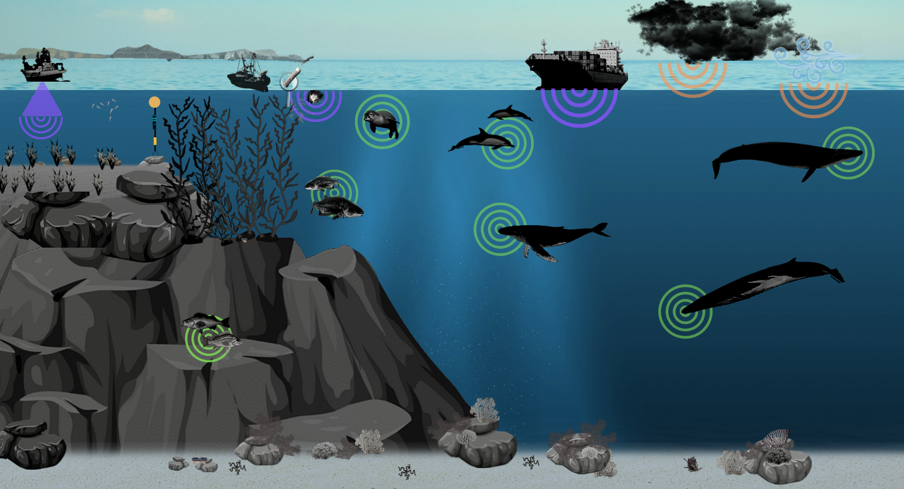

 

  

  
  

  <a href="q_what-hear.html" class="stretched-link">
  <h4 class="card-title align-self-center mx-auto">What did we hear?</h4></a>
  

 

 

  

  
  

  <a href="q_how-listen.html" class="stretched-link">
  <h4 class="card-title align-self-center mx-auto">How did we listen?</h4></a>
  

