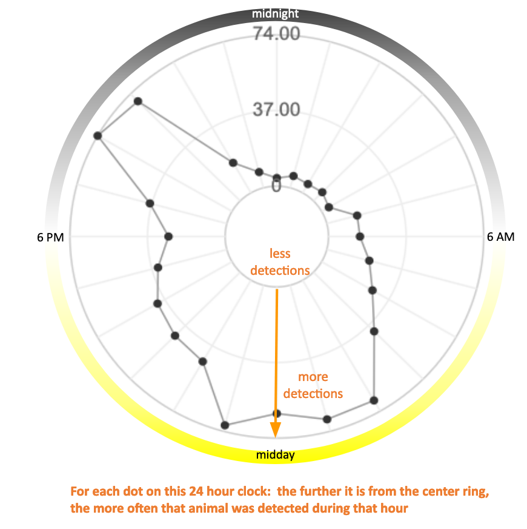

```{r setup, include=FALSE}
knitr::opts_chunk$set(echo = F)
```

_Ever traveled to a new city and noticed how different it sounded from home? Sometimes you know immediately what is making a sound as it is relatively common and sounds about the same wherever you go (train passing by, airplanes taking off, truck backing up). Other sounds might be harder to figure out: what bird makes that call? Is that a coyote howling in the distance?_

The 30 listening stations in 7 U.S. National Marine Sanctuaries and 1 Marine National Monument in this project were selected to record ocean sounds over several years. We chose spots most likely to have a variety of sounds including physical processes, animals, and human activities. Reef-living invertebrates like snapping shrimp, calling fish and whales, boats, explosions from fishing activities, sonars used in military training, are a few of the expected and relatively well-characterized sources of sound in the ocean.

Under the “What did we hear” tab for each sanctuary, interactive infographics showcase the many different sources of sound that we identified and tracked through our recording efforts. Clicking on the icons of sound sources on the infographic, for example the humpback whale, opens a window in which you can listen to sound clips recorded at that sanctuary and learn more about daily, monthly or annual patterns that were detected in that sanctuary.


‘Sounds’ pull down in the Navigation Bar lists all the sound clips available through the interactive infographics across all eight sanctuaries. For a catalog of all the sound clips available for this entire project, head to the SanctSound data portal by selecting ‘Spectrograms’ under the ‘Statistics’ pull down in the Navigation Bar.

Only a few types of sounds were present at all recording locations. These include the underwater sounds made by wind and waves, and boats. Some sounds were present over many locations, including sounds made by snapping shrimp and humpback whales. Still others were present in only one or a few locations, like calling groupers in the Florida Keys National Marine Sanctuary or calling Atlantic cod in the Stellwagen Bank National Marine Sanctuary.

Many of the sounds produced by animals are constrained to specific tones or frequencies . Therefore, changes in levels or intensities of sound at certain frequencies during different time periods can be linked to different animal sources. Similarly, the bursting of bubbles off boat propellers produce sounds with specific frequency content allowing levels of sound at lower frequencies to track boat presence around listening stations. Natural environmental forces like wind and waves produce sound underwater that are heightened at specific frequencies and can be used to track the presence of storms and other weather activity at recording locations.

<div class='row'>
<div class='col-xs-6'>

**Bocaccio**:

<video controls width="100%">
<source src="./files/SanctSound_CI01_Bocaccio_20181101.mp4" type="video/mp4">
Your browser does not support the video tag.
</video>
  
</div>
<div class='col-xs-6'>

**Dolphins**:
  
<video controls width="100%">
<source src="./files/SanctSound_CI01_03_dolphins_20190904T064203Z.mp4" type="video/mp4">
Your browser does not support the video tag.
</video>

</div> <!-- end: col -->
</div> <!-- end: row -->

<div class='row'>
<div class='col-xs-12'>

**Seal bombs**:

<video width="100%" controls>
<source src="./files/SanctSound_CI05_02_SealBomb_20190405T110516.mp4" type="video/mp4">
Your browser does not support the video tag.
</video>

</div> <!-- end: col -->
</div> <!-- end: row -->


While there are many sounds of unknown origin in our data, sounds that are well described and relatively consistent can be “detected” by automated processes. Because computers aren’t perfect, scientists verify the automated detection results. This process allows us to determine how the automated detector performed in different places, including how well it worked in a louder environment or for specific types of sound.

There are many ways to showcase the contributions of known sounds detected at recording locations. Sounds produced by animals often peak during specific periods of the day, and during specific months or seasons based on the roles the sound plays in the animals’ reproductive, feeding or migratory  activity. For many of the sound sources in a sanctuary, we show how frequently the sound was detected during the project’s 3 year recording period. For example, we can graph the number of times a certain sound is detected each month to look for times of year when that sound is a more or less important component of the sanctuary soundscape. The plot below shows the occurrence of vessel sounds detected at a listening station in FKNMS.


We can also visualize whether detections varied over the course of a day by counting how many times a sound is detected in each hour and plotting that on a graph that looks like a 24 hour clock. For example, outboard motors are more commonly recorded during daylight hours since that is the time of day when most people go out fishing and boating.



These types of monthly and daily patterns are shown under the ‘What did we hear’ tab for many of the sound sources on a sanctuary’s interactive infographic. For those interested in a deeper exploration of detection patterns, select ‘Detections’ under the ‘Statistics’ pull down in the Navigation Bar to access tools in the SanctSound data portal for comparing detections across stations within a sanctuary and across different sanctuaries.
