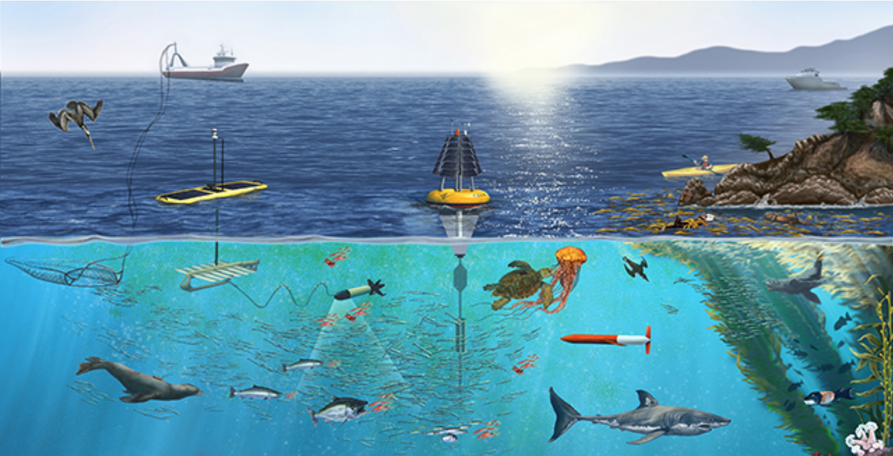
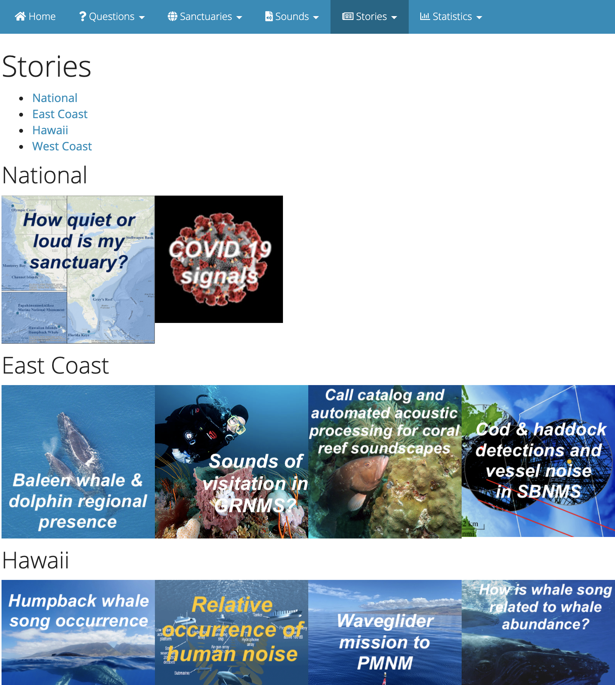

```{r setup, include=FALSE}
knitr::opts_chunk$set(echo = F)
```

_Ever tried to identify something by touching it with your eyes blindfolded? Or tried to enjoy food with a congested nose? Like most animals, we gather information from a variety of sources to make sense of the world around us. Rarely do we experience input from any one source in isolation. Similarly, sound is one of many ways that marine animals experience their environments, and one of many ways that we can study those environments. We gain the most understanding when we add what we hear to other ways of understanding a place._



A main goal of the SanctSound project was to collect and measure sound attributes in a way that would support adding this acoustic information to the other types of observations we make in U.S. National Marine Sanctuaries in order to better understand and protect these special places. Underwater sound recordings, when made over long periods of time in coordinated, standardized and informative ways, can greatly enhance what we learn from other measurement systems, including satellites, SCUBA surveys and research cruises, that aim to characterize the diversity and health of marine environments. 

In the stories section of this website, you will find a collection of stories that showcase what we have learned through combining this new acoustic information with other available information on marine animals, ocean conditions, and human activities in these sanctuaries. Through photos, videos, maps and graphs, these stories bring to life some of the fascinating patterns we have discovered about how both animals and humans use our National Marine Sanctuaries and how understanding those patterns are important to the people who are charged with managing these special places. 



SanctSound stories span a range of geographic scales from local to national. National level stories are focused on comparing patterns of sound among our national marine sanctuaries to help us to examine similarities and differences across the system. For example, one national story compares the types and amounts of sound produced by vessels across sanctuaries and another story examines the impact of COVID-19 on our ocean soundscapes during the SanctSound project. Other stories are focused on what we learned about sound in a specific sanctuary or region and how that information can help inform management at those sites. For example, a Monterey Bay-focused story examines the contribution of cruise ships to the sanctuary's soundscape while another story examines the occurrence of humpback whale song across the Hawaiin archipelago.  


