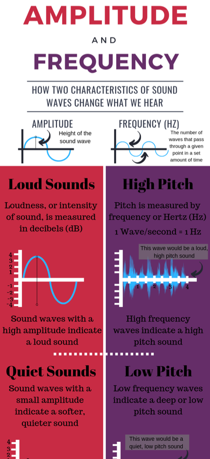
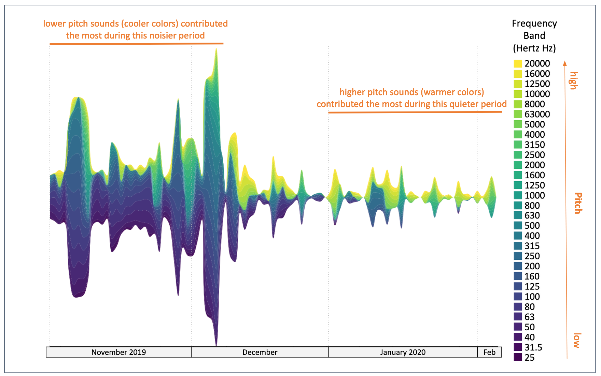
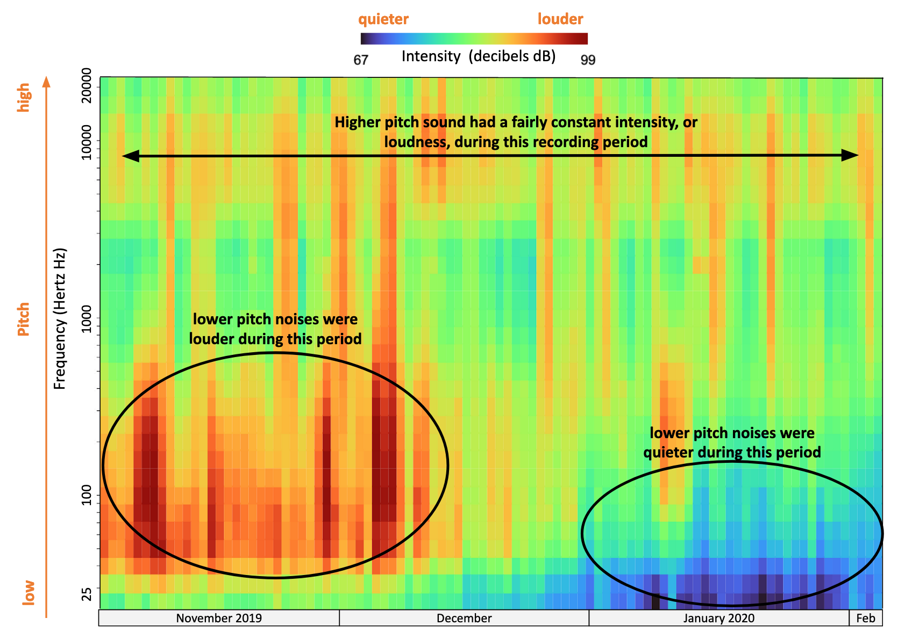
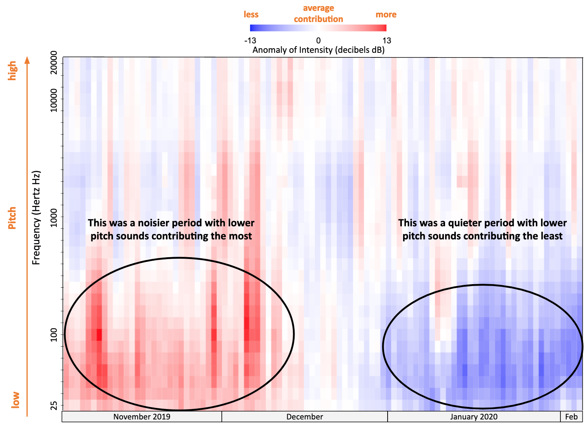
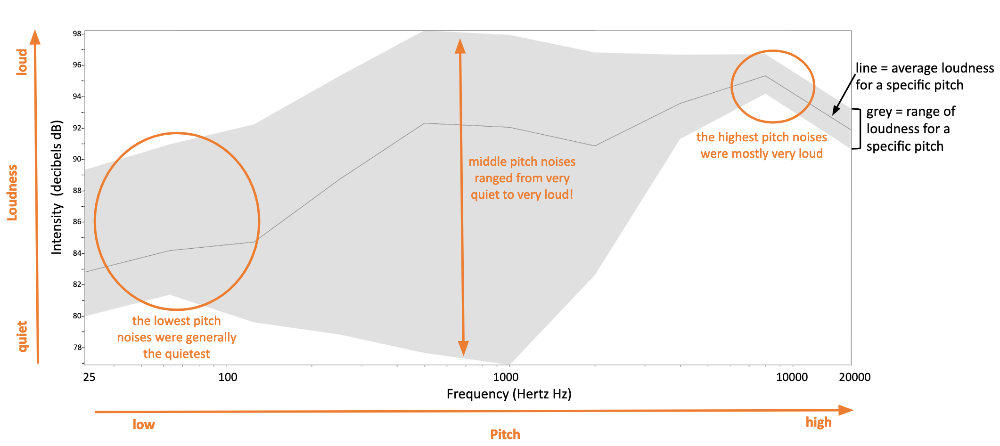
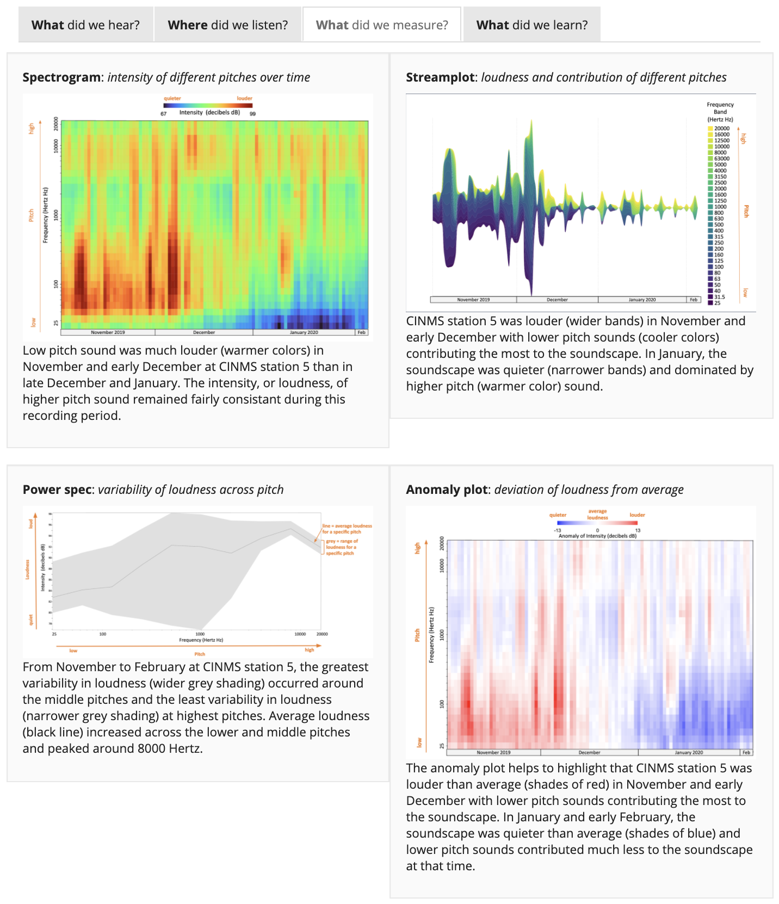

```{r setup, include=FALSE}
knitr::opts_chunk$set(echo = F)
```

_Ever tried to negotiate where to sit at a concert with a friend who thinks it’s much louder up front than you do? Or wondered how cars are rated loud or quiet? What was it about what you heard, or didn’t hear, that you noticed? Common measurement methods are key to providing a baseline for comparing the acoustic attributes of different places before taking into account differences in how we each experience them._




This project recorded underwater sound continuously at 30 locations in U.S. National Marine Sanctuaries over 3 years. This effort resulted in a very large amount of information. In fact, this project generated 300 terabytes of data. For context, approximately 500 hours’ worth of movies can fit in one terabyte. This web portal allows you to easily explore much of that data, and showcases the types of information that sound can provide to help us understand and protect our oceans and its inhabitants.

Here you can explore the loudness of each U.S. National Marine Sanctuary, and make comparisons among locations to better understand how similar or different they are from each other. To do this, we not only had to record sound information in a comparable way [see [How did we listen?](./q_how-listen.html)], we needed to make the same measurements from these recordings.

Sound can be described in a variety of different ways [[DOSITS characterizing sound](https://dosits.org/science/sound/characterize-sounds/)]. Two key attributes of sounds are their intensity and frequency.  Intensity or “loudness” is measured in decibels and describes how much pressure or energy the sound contains; a low decibel sound contains much less energy than a high decibel sound. Frequency provides information about the mix of lower and higher pitches or tones that are contained in a sound. Other attributes describe how the sound occurred over time: was it a short burst of sound or a long-lasting hum? Our measurements of “levels” of sounds summarize all these attributes: intensity, frequency content, and duration. 


### Stream plots: Loudness and contribution of different pitches

For all long-term (multiyear) measurement projects, it’s important to know both what the average condition was as well as how conditions varied around that average over time. If there was a lot of change in sound levels over time, we need to understand if it was louder across all frequencies or did a specific range of frequencies (and usually a specific source of sound) drive those changes. We use stream graphs to summarize those differences all in one image. For example, in this stream plot from a listening station in Channel Islands sanctuary, notice how the stream is wider (noisier) during the first half of the time period and narrower (quieter) during the second half. This noisier period is dominated by blue colors which correspond to sounds with lower pitch (or frequency) while the quieter period is dominated by yellow and green colors corresponding to higher pitch sounds. 




### Spectrograms: Intensity of sound at different pitches over time

Another tool for visualizing changes in the soundscape over time is the spectrogram. A spectrogram uses color to show the intensity (or loudness) of sound at various frequencies (or pitches) over time. Not only can you see whether sound is more or less intense at different frequencies, for example, 100 Hertz vs 1000 Hertz, but you can also see how intensity levels vary over time. In this example spectrogram from a listening station in Channel Islands sanctuary, lower pitch sounds were some of the loudest (warmer colors) contributors to the soundscape early in the recording period, but were much quieter (cooler colors) later in the recording period.



### Anomaly plot:  Deviation of loudness from average

To visualize how loudness deviated from an average, we provide anomaly plots. For different pitches ranging from low to high, the red shows the time periods when sound within a pitch was louder than average while blue shows the time periods when the sound was quieter than average. The white areas indicate times and pitches of average loudness contributing to the soundscape. These plots help us identify time periods of “normal” loudness as well as extremely loud or quiet events.



## Power spec: variability of loudness across pitch

While the 3 plot types above allow us to see how the soundscape at a listening station in the Channel Islands sanctuary has changed over time, it is also important to understand how the variability of loudness changes across different pitches for an entire listening period. Power spec plots help us to do just that. The black line in the power spec plots shows the average loudness of sound at a specific pitch while the gray band shows the variability in loudness at that same pitch. In this example plot, the higher pitch sounds were very loud (high average loudness) and consistently so throughout the study period (narrow gray band). Low pitch sounds were much quieter on average (low average loudness), but less consistently so (wider grey band). The most variability in loudness occurred at pitches between 700-1000 Hertz, which appear to have fluctuated from very quiet to very loud over the duration of the recording period.



## Sanctuary - What did we measure?

One set of these four plot types - Stream plot, spectrogram, power spec and anomaly - is displayed under the ‘What did we measure’ tab for each sanctuary on the website. For those interested in exploring in more detail the variability in the levels of sound we recorded at a specific listening station or comparing levels among different listening stations, head to the SanctSound data portal using the ‘Statistics’ pull down in the Navigation Bar. 


