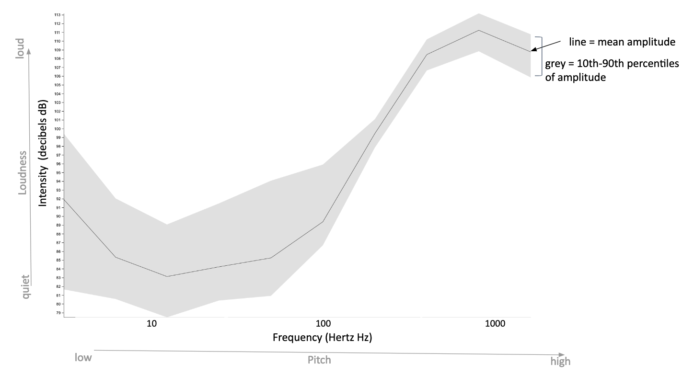
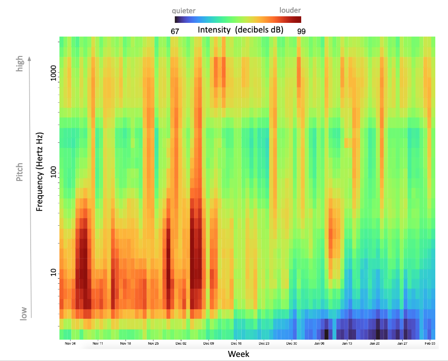
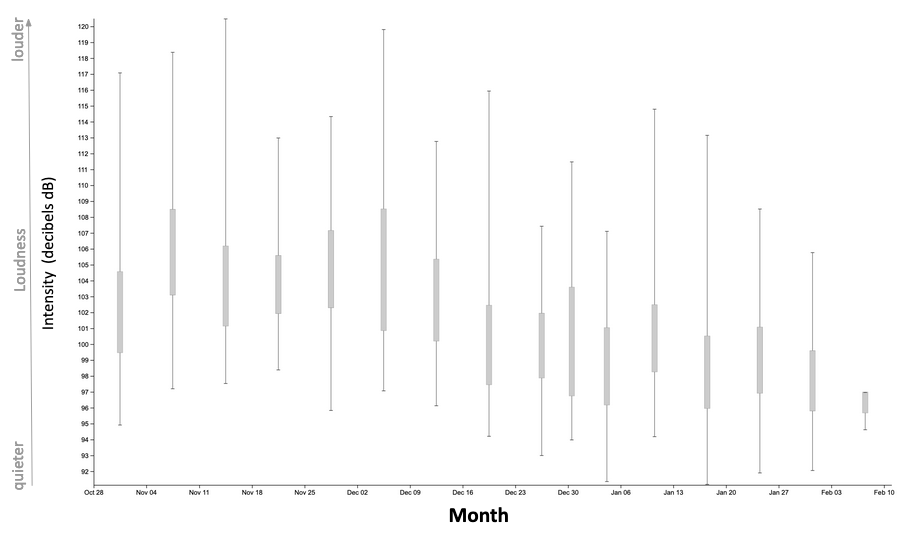

```{r setup, include=FALSE}
knitr::opts_chunk$set(echo = F)
```

_Ever tried to negotiate where to sit at a concert with a friend who thinks it’s much louder than you do up front? Or wondered what goes into reviewers reporting on how loud or how quiet specific cars are? What was it about what you heard, or didn’t hear, that you noticed? Common measurement methods are key to providing a baseline for comparing the acoustic attributes of different places before taking into account differences in how we each experience them._


This project recorded underwater sound continuously at 30 locations in U.S. National Marine Sanctuaries over 2 to 3 years. This effort resulted in a very large amount of information. In fact, this project generated 300 terabytes of data. For context, approximately 500 hours’ worth of movies can fit in one terabyte. This web portal allows you to easily explore much of that data, and showcases the types of information that sound can provide to help us understand and protect our oceans and its inhabitants.

Here you can explore how noisy or quiet each U.S. National Marine Sanctuary is, and make comparisons among locations to understand how similar or different they are from each other. To do this, we not only have to record sound information in a comparable way [How did we listen?], we need to make the same measurements from these recordings.

Sound can be described in a variety of different ways [DOSITS characterizing sound]. Two key attributes of sounds are 1) their intensity [r](how much pressure or energy they contain, which we experience as “loudness”) and 2) their frequency content (the mix of lower and higher pitches or tones that are contained in a sound). Other attributes describe how the sound occurred over time: was it a short burst of sound or a long-lasting hum? Our measurements of “levels” of sounds summarize all these attributes: intensity, frequency content, and duration.




For all long-term (multiyear) measurement projects, it’s important to know both what the average condition was as well as how conditions varied around that average over time. If there was a lot of change in sound levels over time, we need to understand if it was louder across all frequencies or did a specific range of frequencies (and usually a specific source of sound) drive those changes. We use stream graphs to summarize those differences all in one image. For example, here are two stream graphs for two different locations in this project XX and YY. Notice how the width of the XX stream is relatively consistent, with changes from average conditions moderate with ….. In contrast, at YY notice how there are big changes in levels in XX and XX seen by the large amount of QQ color which contains tones in the XX range. This coincides with XX.

Click on the stream graph If you are interested in a deep dive  to further explore the details of the variability in the levels of sound we recorded at this location. Reported measurements are informed by efforts to harmonize data products from international projects [link to IWC and COL report?] and project objectives to support web-based exploration.



