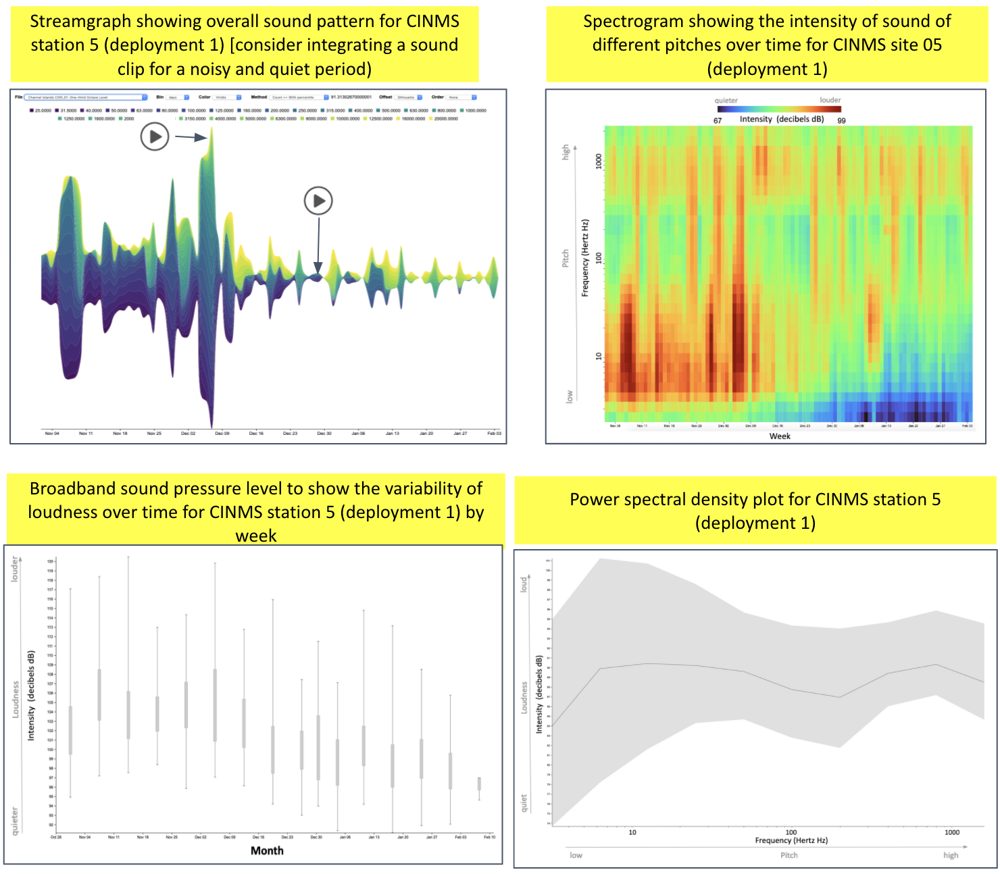

```{r setup, include=FALSE}
knitr::opts_chunk$set(echo = F, message = F, warning = F)
```

## {.tabset}

### **What** did we hear?

<!-- `r shiny::icon("info-circle")` -->
Click on an element to see & hear more.

```{r svg, child = '_svg-html_child.Rmd'}
```

### **Where** did we listen?

Here is a map of listening device locations. Hover on a location to see its site id and click on it to see the rationale for its placement.
<!-- `r shiny::icon("map")` -->

```{r}
source(here::here("functions.R"))
map_site(params$site_code)
```

### **What** did we measure?



### **What** did we learn?

**Stories**

- What do humming sounds detected at Santa Rosa Island tell us?
- Listening to and tracking movements of giant sea bass reveal their habits

[TODO: add to Stories]

