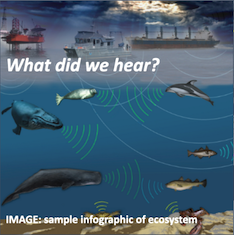
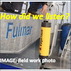
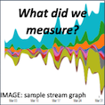
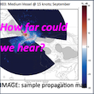

```{r setup, include=FALSE}
knitr::opts_chunk$set(echo = TRUE)
```


<div class="col col-md-6 text-right" style="padding-right:0px;">
  <a href="q_what-hear.html"> 
  
  <!--h3>What did we hear?</h3>
  <p>Natural and man-made noise from various sources...</p-->
  </a>
</div>
<div class="col col-md-6 text-left">

  <div class="row">
  <a href="q_how-listen.html">
  <!--h3>How did we listen?</h3>
  <p>Using acoustic receivers...</p-->
  
  </a>
  <a href="q_what-measure.html"> 
  <!--h3>What did we measure?</h3>
  <p>Measuring sound levels at different octaves over time...</p-->
  
  </a>
  </div>
  
  <div class="row">
  <a href="q_how-far.html"> 
  
  <!--h3>How far could we hear?</h3>
  <p>Based on sound profile of water...</p-->
  </a>
  <a href="q_what-learn.html"> 
  
  <!--h3>What did we learn?</h3>
  <p>How do we advise human activities...</p-->
  </a>
  </div>
</div>


